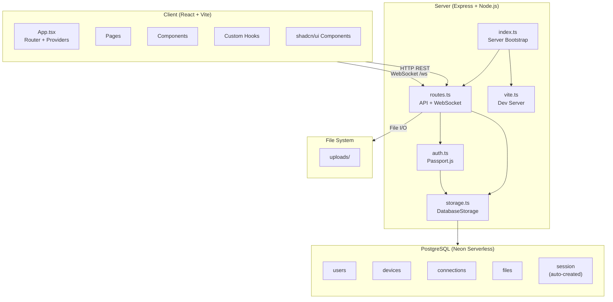
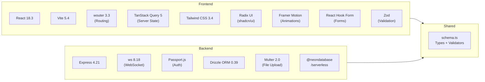
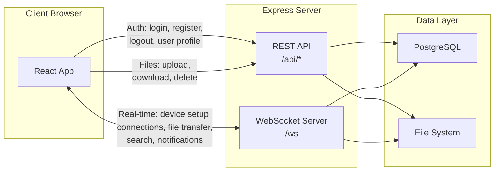

# SnapSend - System Architecture Overview

## High-Level Architecture

```mermaid
graph TB
    subgraph Client["Client (React + Vite)"]
        direction TB
        App["App.tsx<br/>Router + Providers"]
        Pages["Pages"]
        Components["Components"]
        Hooks["Custom Hooks"]
        UI["shadcn/ui Components"]
    end

    subgraph Server["Server (Express + Node.js)"]
        direction TB
        Index["index.ts<br/>Server Bootstrap"]
        Routes["routes.ts<br/>API + WebSocket"]
        Auth["auth.ts<br/>Passport.js"]
        Storage["storage.ts<br/>DatabaseStorage"]
        ViteDev["vite.ts<br/>Dev Server"]
    end

    subgraph Database["PostgreSQL (Neon Serverless)"]
        direction TB
        UsersTable["users"]
        DevicesTable["devices"]
        ConnectionsTable["connections"]
        FilesTable["files"]
        SessionsTable["session<br/>(auto-created)"]
    end

    subgraph FileSystem["File System"]
        Uploads["uploads/"]
    end

    Client -->|"HTTP REST"| Routes
    Client -->|"WebSocket /ws"| Routes
    Routes --> Auth
    Routes --> Storage
    Auth --> Storage
    Storage --> Database
    Routes -->|"File I/O"| FileSystem
    Index --> Routes
    Index --> ViteDev
```

## Technology Stack

```mermaid
graph LR
    subgraph Frontend
        React["React 18.3"]
        Vite["Vite 5.4"]
        Wouter["wouter 3.3<br/>(Routing)"]
        RQ["TanStack Query 5<br/>(Server State)"]
        Tailwind["Tailwind CSS 3.4"]
        Radix["Radix UI<br/>(shadcn/ui)"]
        Framer["Framer Motion<br/>(Animations)"]
        RHF["React Hook Form<br/>(Forms)"]
        Zod["Zod<br/>(Validation)"]
    end

    subgraph Backend
        Express["Express 4.21"]
        WS["ws 8.18<br/>(WebSocket)"]
        Passport["Passport.js<br/>(Auth)"]
        Drizzle["Drizzle ORM 0.39"]
        Multer["Multer 2.0<br/>(File Upload)"]
        Neon["@neondatabase<br/>/serverless"]
    end

    subgraph Shared
        Schema["schema.ts<br/>Types + Validators"]
    end

    Frontend --> Shared
    Backend --> Shared
```

## Directory Structure

```mermaid
graph TD
    Root["SnapSend/"]
    Root --> ClientDir["client/src/"]
    Root --> ServerDir["server/"]
    Root --> SharedDir["shared/"]
    Root --> UploadsDir["uploads/"]
    Root --> Config["Config Files"]

    ClientDir --> AppFile["App.tsx"]
    ClientDir --> MainFile["main.tsx"]
    ClientDir --> PagesDir["pages/"]
    ClientDir --> ComponentsDir["components/"]
    ClientDir --> HooksDir["hooks/"]
    ClientDir --> LibDir["lib/"]

    PagesDir --> Landing["landing-page.tsx"]
    PagesDir --> AuthPg["auth-page.tsx"]
    PagesDir --> Home["Home.tsx"]
    PagesDir --> NotFound["not-found.tsx"]

    ComponentsDir --> ConnMgr["ConnectionManager.tsx"]
    ComponentsDir --> DevSetup["DeviceSetup.tsx"]
    ComponentsDir --> FileExp["FileExplorer.tsx"]
    ComponentsDir --> Sidebar["Sidebar.tsx"]
    ComponentsDir --> Settings["SettingsPage.tsx"]
    ComponentsDir --> UIDir["ui/ (40+ shadcn)"]

    HooksDir --> UseAuth["use-auth.tsx"]
    HooksDir --> UseConn["useConnectionSystem.ts"]
    HooksDir --> UseFile["useFileTransfer.ts"]
    HooksDir --> UseWS["useWebSocket.ts"]
    HooksDir --> UseToast["use-toast.ts"]

    LibDir --> ProtRoute["protected-route.tsx"]
    LibDir --> QClient["queryClient.ts"]
    LibDir --> Utils["utils.ts"]

    ServerDir --> SIndex["index.ts"]
    ServerDir --> SRoutes["routes.ts"]
    ServerDir --> SAuth["auth.ts"]
    ServerDir --> SStorage["storage.ts"]
    ServerDir --> SDB["db.ts"]
    ServerDir --> SSeed["seed.ts"]
    ServerDir --> SVite["vite.ts"]

    SharedDir --> SchemaFile["schema.ts"]

    Config --> Pkg["package.json"]
    Config --> TSConfig["tsconfig.json"]
    Config --> ViteConfig["vite.config.ts"]
    Config --> DrizzleConfig["drizzle.config.ts"]
    Config --> TWConfig["tailwind.config.ts"]
```

## Communication Patterns

```mermaid
graph LR
    subgraph "Client Browser"
        ReactApp["React App"]
    end

    subgraph "Express Server"
        REST["REST API<br/>/api/*"]
        WSS["WebSocket Server<br/>/ws"]
    end

    subgraph "Data Layer"
        PG["PostgreSQL"]
        Disk["File System"]
    end

    ReactApp -->|"Auth: login, register,<br/>logout, user profile"| REST
    ReactApp -->|"Files: upload,<br/>download, delete"| REST
    ReactApp <-->|"Real-time: device setup,<br/>connections, file transfer,<br/>search, notifications"| WSS

    REST --> PG
    REST --> Disk
    WSS --> PG
    WSS --> Disk
```
