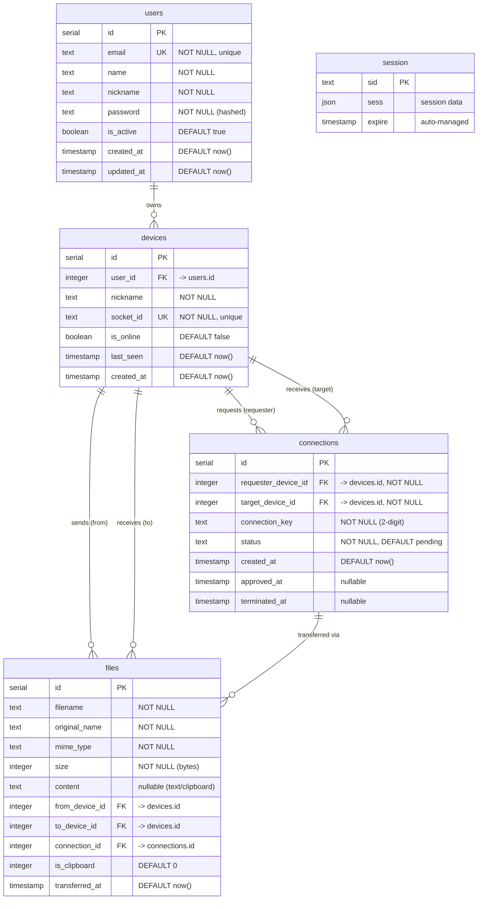
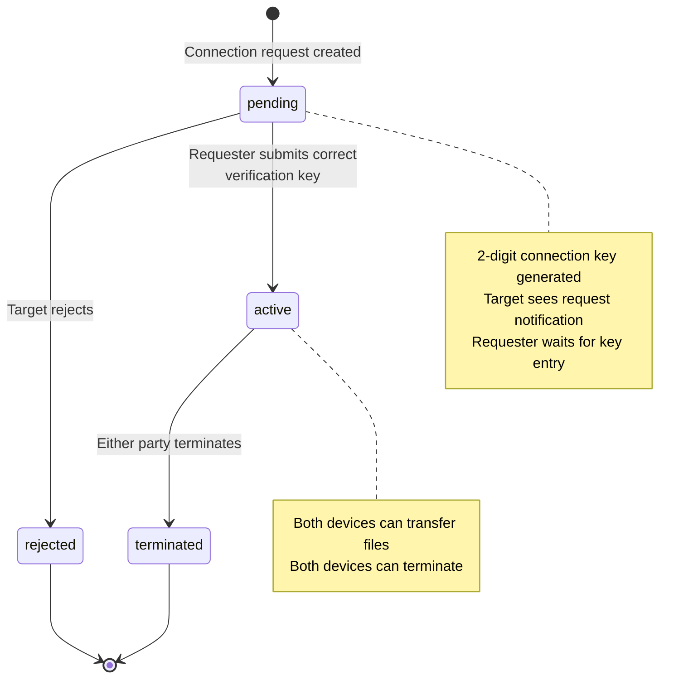
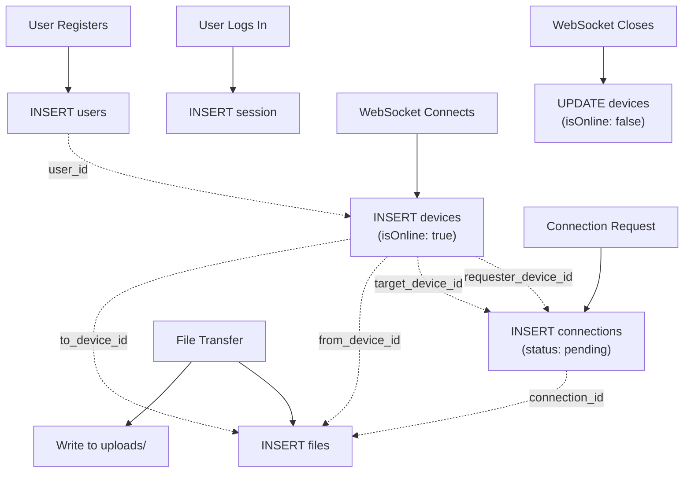
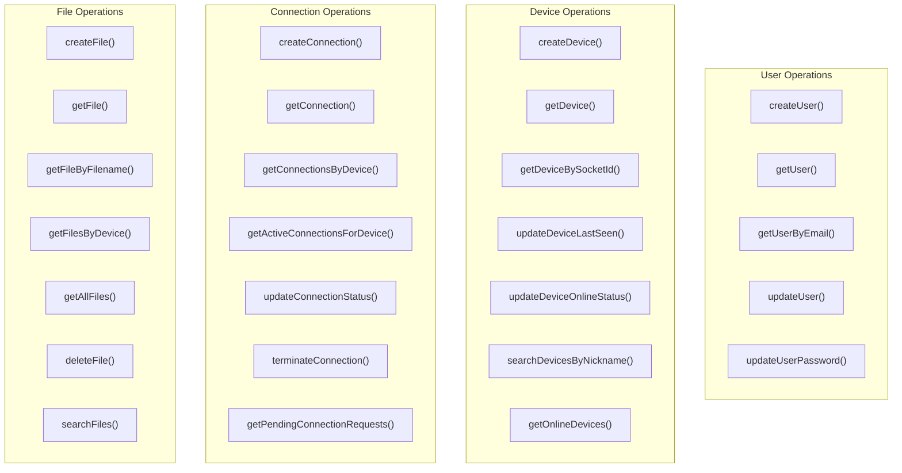

# SnapSend - Database Schema & Relationships

## Entity Relationship Diagram

```mermaid
erDiagram
    users {
        serial id PK
        text email UK "NOT NULL, unique"
        text name "NOT NULL"
        text nickname "NOT NULL"
        text password "NOT NULL (hashed)"
        boolean is_active "DEFAULT true"
        timestamp created_at "DEFAULT now()"
        timestamp updated_at "DEFAULT now()"
    }

    devices {
        serial id PK
        integer user_id FK "-> users.id"
        text nickname "NOT NULL"
        text socket_id UK "NOT NULL, unique"
        boolean is_online "DEFAULT false"
        timestamp last_seen "DEFAULT now()"
        timestamp created_at "DEFAULT now()"
    }

    connections {
        serial id PK
        integer requester_device_id FK "-> devices.id, NOT NULL"
        integer target_device_id FK "-> devices.id, NOT NULL"
        text connection_key "NOT NULL (2-digit)"
        text status "NOT NULL, DEFAULT pending"
        timestamp created_at "DEFAULT now()"
        timestamp approved_at "nullable"
        timestamp terminated_at "nullable"
    }

    files {
        serial id PK
        text filename "NOT NULL"
        text original_name "NOT NULL"
        text mime_type "NOT NULL"
        integer size "NOT NULL (bytes)"
        text content "nullable (text/clipboard)"
        integer from_device_id FK "-> devices.id"
        integer to_device_id FK "-> devices.id"
        integer connection_id FK "-> connections.id"
        integer is_clipboard "DEFAULT 0"
        timestamp transferred_at "DEFAULT now()"
    }

    session {
        text sid PK
        json sess "session data"
        timestamp expire "auto-managed"
    }

    users ||--o{ devices : "owns"
    devices ||--o{ connections : "requests (requester)"
    devices ||--o{ connections : "receives (target)"
    devices ||--o{ files : "sends (from)"
    devices ||--o{ files : "receives (to)"
    connections ||--o{ files : "transferred via"
```

## Connection Status State Machine

```mermaid
stateDiagram-v2
    [*] --> pending : Connection request created
    pending --> rejected : Target rejects
    pending --> active : Requester submits correct<br/>verification key
    rejected --> [*]
    active --> terminated : Either party terminates
    terminated --> [*]

    note right of pending
        2-digit connection key generated
        Target sees request notification
        Requester waits for key entry
    end note

    note right of active
        Both devices can transfer files
        Both devices can terminate
    end note
```

## Data Flow Through Tables

```mermaid
flowchart TD
    Register["User Registers"] --> UserRow["INSERT users"]
    Login["User Logs In"] --> SessionRow["INSERT session"]

    WSConnect["WebSocket Connects"] --> DeviceRow["INSERT devices<br/>(isOnline: true)"]
    UserRow -.->|"user_id"| DeviceRow

    ConnRequest["Connection Request"] --> ConnRow["INSERT connections<br/>(status: pending)"]
    DeviceRow -.->|"requester_device_id"| ConnRow
    DeviceRow -.->|"target_device_id"| ConnRow

    FileTransfer["File Transfer"] --> FileRow["INSERT files"]
    DeviceRow -.->|"from_device_id"| FileRow
    DeviceRow -.->|"to_device_id"| FileRow
    ConnRow -.->|"connection_id"| FileRow
    FileTransfer --> DiskWrite["Write to uploads/"]

    WSDisconnect["WebSocket Closes"] --> DeviceOffline["UPDATE devices<br/>(isOnline: false)"]
```

## Storage Interface Methods

```mermaid
graph TD
    subgraph "User Operations"
        CU["createUser()"]
        GU["getUser()"]
        GUE["getUserByEmail()"]
        UU["updateUser()"]
        UUP["updateUserPassword()"]
    end

    subgraph "Device Operations"
        CD["createDevice()"]
        GD["getDevice()"]
        GDSI["getDeviceBySocketId()"]
        UDLS["updateDeviceLastSeen()"]
        UDOS["updateDeviceOnlineStatus()"]
        SDN["searchDevicesByNickname()"]
        GOD["getOnlineDevices()"]
    end

    subgraph "Connection Operations"
        CC["createConnection()"]
        GC["getConnection()"]
        GCBD["getConnectionsByDevice()"]
        GACFD["getActiveConnectionsForDevice()"]
        UCS["updateConnectionStatus()"]
        TC["terminateConnection()"]
        GPCR["getPendingConnectionRequests()"]
    end

    subgraph "File Operations"
        CF["createFile()"]
        GF["getFile()"]
        GFBF["getFileByFilename()"]
        GFBD["getFilesByDevice()"]
        GAF["getAllFiles()"]
        DF["deleteFile()"]
        SF["searchFiles()"]
    end
```
