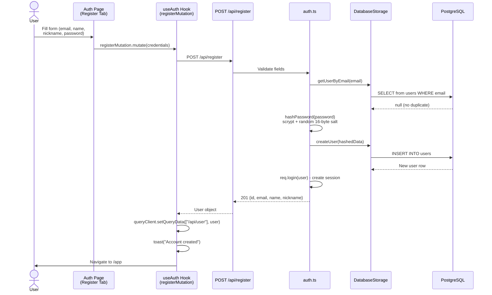
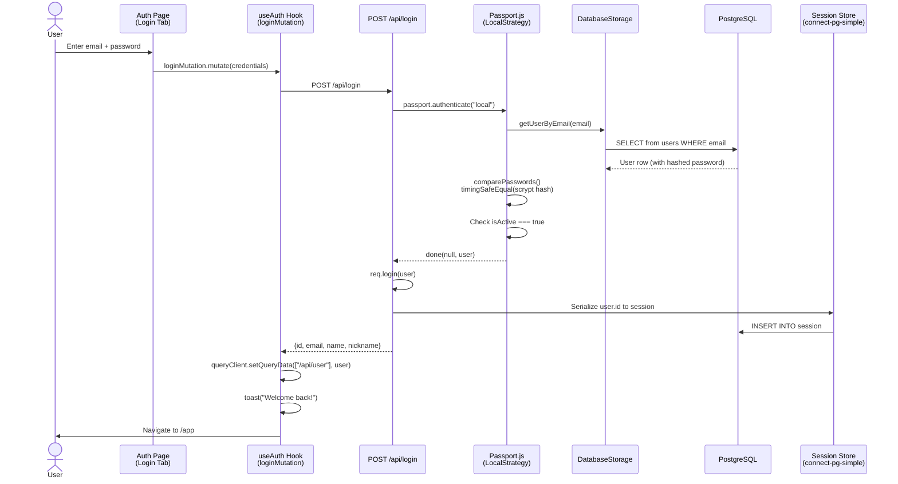
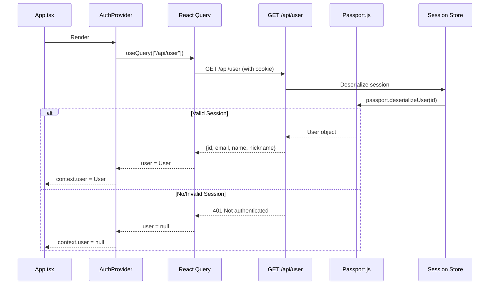
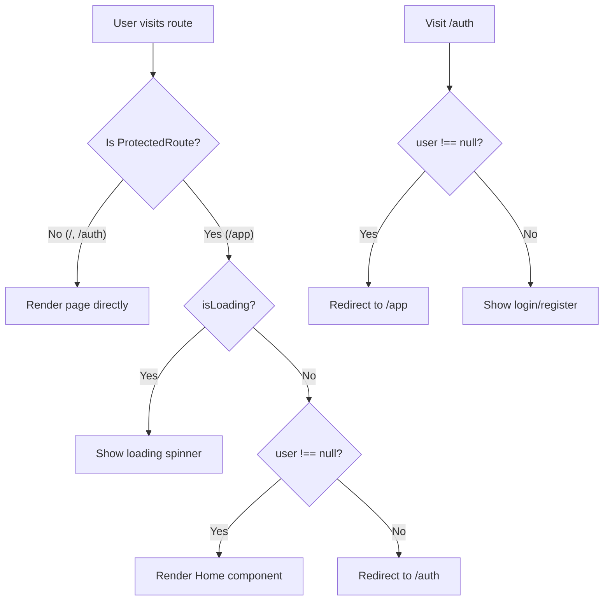
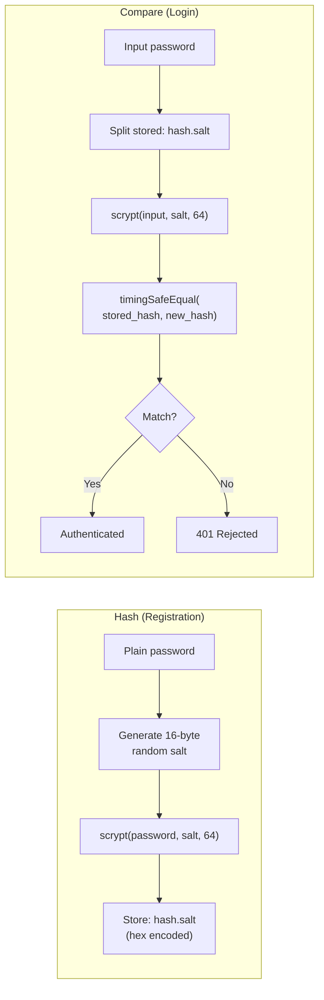
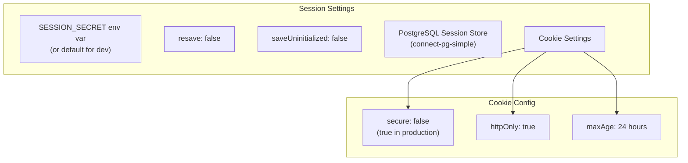

# SnapSend - Authentication Flow

## Registration Flow

```mermaid
sequenceDiagram
    actor User
    participant AuthPage as Auth Page<br/>(Register Tab)
    participant useAuth as useAuth Hook<br/>(registerMutation)
    participant API as POST /api/register
    participant Auth as auth.ts
    participant Storage as DatabaseStorage
    participant DB as PostgreSQL

    User->>AuthPage: Fill form (email, name,<br/>nickname, password)
    AuthPage->>useAuth: registerMutation.mutate(credentials)
    useAuth->>API: POST /api/register
    API->>Auth: Validate fields
    Auth->>Storage: getUserByEmail(email)
    Storage->>DB: SELECT from users WHERE email
    DB-->>Storage: null (no duplicate)
    Auth->>Auth: hashPassword(password)<br/>scrypt + random 16-byte salt
    Auth->>Storage: createUser(hashedData)
    Storage->>DB: INSERT INTO users
    DB-->>Storage: New user row
    Auth->>Auth: req.login(user) - create session
    Auth-->>API: 201 {id, email, name, nickname}
    API-->>useAuth: User object
    useAuth->>useAuth: queryClient.setQueryData(["/api/user"], user)
    useAuth->>useAuth: toast("Account created")
    useAuth->>User: Navigate to /app
```

## Login Flow

```mermaid
sequenceDiagram
    actor User
    participant AuthPage as Auth Page<br/>(Login Tab)
    participant useAuth as useAuth Hook<br/>(loginMutation)
    participant API as POST /api/login
    participant Passport as Passport.js<br/>(LocalStrategy)
    participant Storage as DatabaseStorage
    participant DB as PostgreSQL
    participant Session as Session Store<br/>(connect-pg-simple)

    User->>AuthPage: Enter email + password
    AuthPage->>useAuth: loginMutation.mutate(credentials)
    useAuth->>API: POST /api/login
    API->>Passport: passport.authenticate("local")
    Passport->>Storage: getUserByEmail(email)
    Storage->>DB: SELECT from users WHERE email
    DB-->>Storage: User row (with hashed password)
    Passport->>Passport: comparePasswords()<br/>timingSafeEqual(scrypt hash)
    Passport->>Passport: Check isActive === true
    Passport-->>API: done(null, user)
    API->>API: req.login(user)
    API->>Session: Serialize user.id to session
    Session->>DB: INSERT INTO session
    API-->>useAuth: {id, email, name, nickname}
    useAuth->>useAuth: queryClient.setQueryData(["/api/user"], user)
    useAuth->>useAuth: toast("Welcome back!")
    useAuth->>User: Navigate to /app
```

## Session Check (Page Load)

```mermaid
sequenceDiagram
    participant App as App.tsx
    participant AuthProvider as AuthProvider
    participant RQ as React Query
    participant API as GET /api/user
    participant Passport as Passport.js
    participant Session as Session Store

    App->>AuthProvider: Render
    AuthProvider->>RQ: useQuery(["/api/user"])
    RQ->>API: GET /api/user (with cookie)
    API->>Session: Deserialize session
    Session->>Passport: passport.deserializeUser(id)

    alt Valid Session
        Passport-->>API: User object
        API-->>RQ: {id, email, name, nickname}
        RQ-->>AuthProvider: user = User
        AuthProvider-->>App: context.user = User
    else No/Invalid Session
        API-->>RQ: 401 Not authenticated
        RQ-->>AuthProvider: user = null
        AuthProvider-->>App: context.user = null
    end
```

## Protected Route Logic

```mermaid
flowchart TD
    Visit["User visits route"] --> Check{"Is ProtectedRoute?"}

    Check -->|"No (/, /auth)"| Render["Render page directly"]

    Check -->|"Yes (/app)"| Loading{"isLoading?"}
    Loading -->|"Yes"| Spinner["Show loading spinner"]
    Loading -->|"No"| HasUser{"user !== null?"}

    HasUser -->|"Yes"| RenderProtected["Render Home component"]
    HasUser -->|"No"| Redirect["Redirect to /auth"]

    AuthPageCheck["Visit /auth"] --> LoggedIn{"user !== null?"}
    LoggedIn -->|"Yes"| RedirectApp["Redirect to /app"]
    LoggedIn -->|"No"| ShowAuth["Show login/register"]
```

## Password Security

```mermaid
flowchart LR
    subgraph "Hash (Registration)"
        Plain["Plain password"] --> Salt["Generate 16-byte<br/>random salt"]
        Salt --> Scrypt["scrypt(password, salt, 64)"]
        Scrypt --> Stored["Store: hash.salt<br/>(hex encoded)"]
    end

    subgraph "Compare (Login)"
        Input["Input password"] --> Split["Split stored: hash.salt"]
        Split --> Rehash["scrypt(input, salt, 64)"]
        Rehash --> TSE["timingSafeEqual(<br/>stored_hash, new_hash)"]
        TSE --> Result{"Match?"}
        Result -->|"Yes"| Auth["Authenticated"]
        Result -->|"No"| Fail["401 Rejected"]
    end
```

## Session Configuration

```mermaid
graph TD
    subgraph "Session Settings"
        Secret["SESSION_SECRET env var<br/>(or default for dev)"]
        Resave["resave: false"]
        SaveUninit["saveUninitialized: false"]
        Store["PostgreSQL Session Store<br/>(connect-pg-simple)"]
        Cookie["Cookie Settings"]
    end

    subgraph "Cookie Config"
        Secure["secure: false<br/>(true in production)"]
        HttpOnly["httpOnly: true"]
        MaxAge["maxAge: 24 hours"]
    end

    Cookie --> Secure
    Cookie --> HttpOnly
    Cookie --> MaxAge
```
