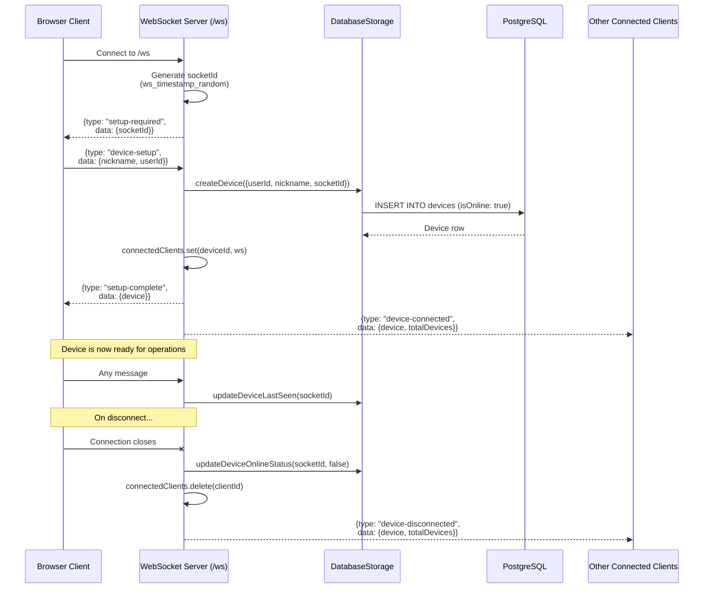
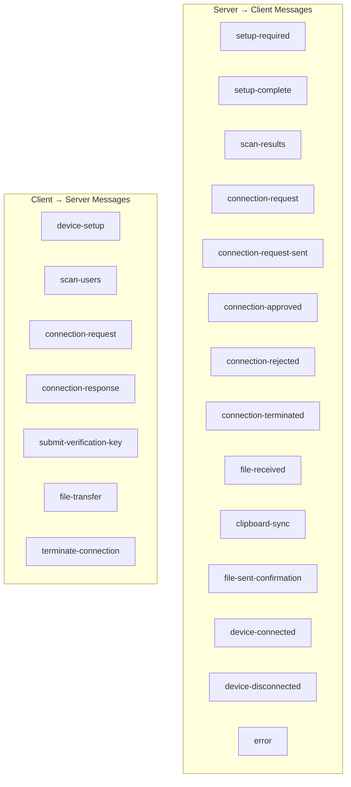
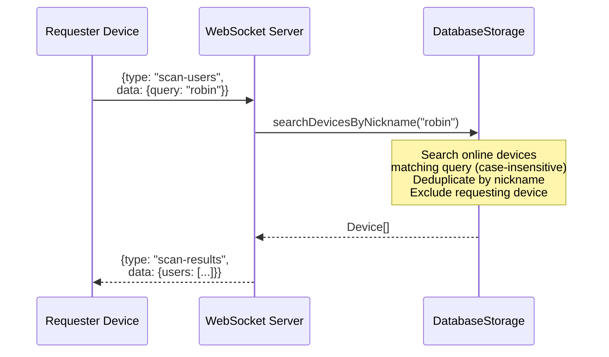
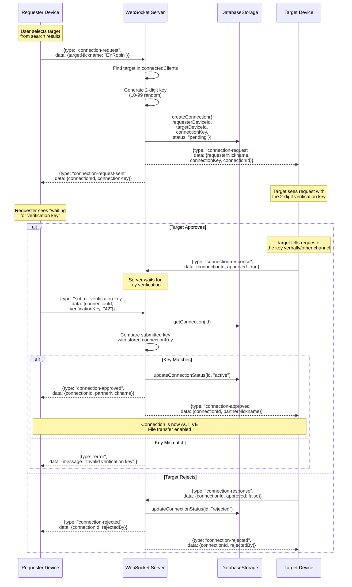
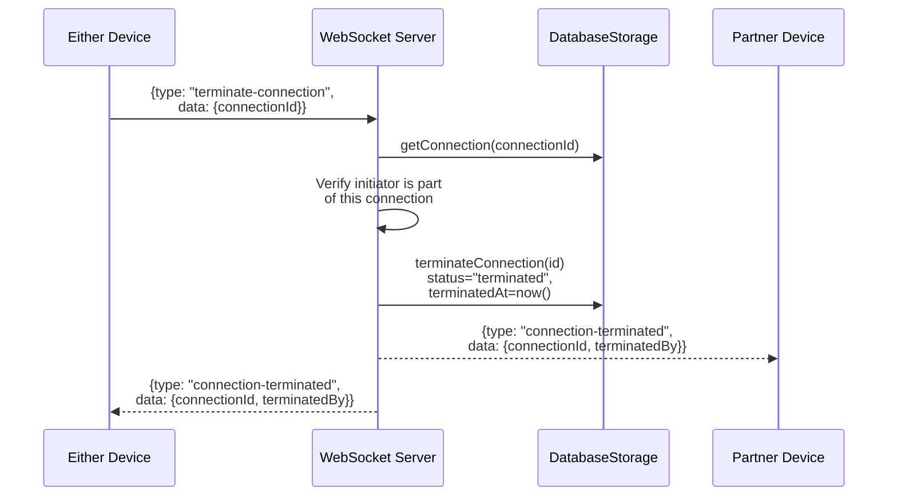
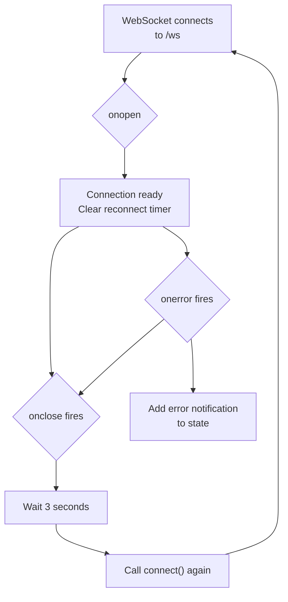
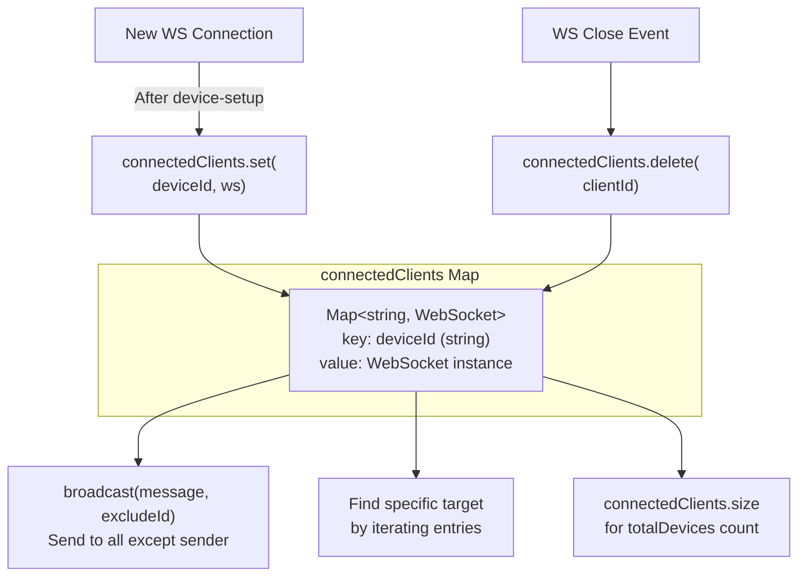

# SnapSend - WebSocket Protocol & Real-Time Communication

## WebSocket Lifecycle

## Complete Message Type Reference

## Device Search Flow

## Connection Establishment (Full Handshake)

## Connection Termination

## Auto-Reconnect Logic (Client)

## Server-Side Client Management

