# SnapSend - File Transfer & Upload System

## WebSocket File Transfer (Device-to-Device)

## HTTP File Upload

## File Download

```mermaid
flowchart TD
    Request["GET /api/files/:id/download"] --> CheckFormat{"ID format?"}

    CheckFormat -->|"Numeric ≤ MAX_INT"| ByID["storage.getFile(id)"]
    CheckFormat -->|"Numeric > MAX_INT"| ByName["storage.getFileByFilename(id)"]
    CheckFormat -->|"Non-numeric"| ByName

    ByID --> Found{"File record<br/>found?"}
    ByName --> Found

    Found -->|"No"| NotFound["404: File not found"]
    Found -->|"Yes"| DiskCheck{"File exists<br/>on disk?"}

    DiskCheck -->|"No"| DiskNotFound["404: File not found on disk"]
    DiskCheck -->|"Yes"| Download["res.download(filePath, originalName)"]
```

## File Delete

## File Content Handling

## Client-Side File Handling

## Dual File Record Creation

