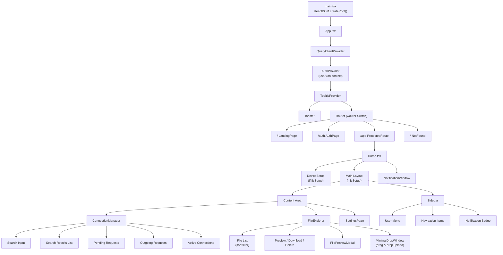
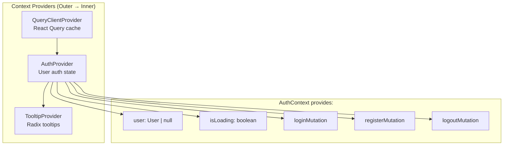
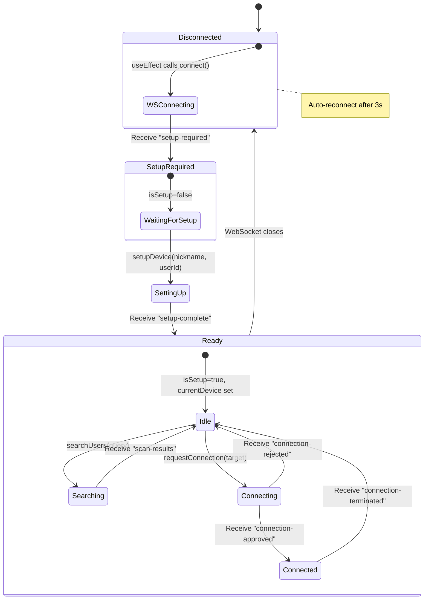
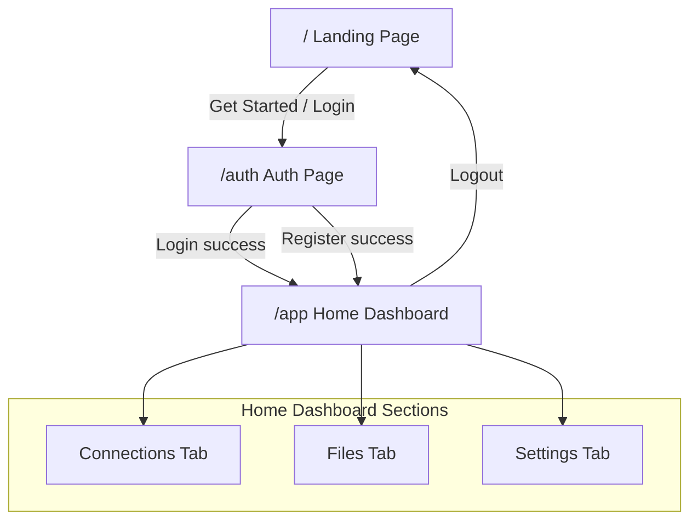

# SnapSend - Client Component Tree & State Management

## React Component Hierarchy

## Provider & Context Architecture

## useConnectionSystem State Machine

## useConnectionSystem - Full State Shape

```mermaid
graph LR
    subgraph "ConnectionSystemState"
        isSetup["isSetup: boolean"]
        isConnecting["isConnecting: boolean"]
        currentDevice["currentDevice: Device | null"]
        connections["connections: Connection[]"]
        files["files: ExtendedFile[]"]
        notifications["notifications: Notification[]"]
        searchResults["searchResults: Device[]"]
        pendingRequests["pendingRequests: Request[]"]
        outgoingRequests["outgoingRequests: Request[]"]
        isSearching["isSearching: boolean"]
    end

    subgraph "Returned Actions"
        setupDevice["setupDevice(nickname, userId)"]
        searchUsers["searchUsers(query)"]
        requestConnection["requestConnection(target)"]
        respondToConnection["respondToConnection(id, approved)"]
        terminateConnection["terminateConnection(id)"]
        sendFile["sendFile(fileData)"]
        submitVerificationKey["submitVerificationKey(id, key)"]
        dismissNotification["dismissNotification(id)"]
        clearAllNotifications["clearAllNotifications()"]
        clearAllFiles["clearAllFiles()"]
        refreshFiles["refreshFiles()"]
        deleteFile["deleteFile(id)"]
    end
```

## WebSocket Message → State Update Map

```mermaid
flowchart TD
    subgraph "Incoming Messages"
        M1["setup-required"]
        M2["setup-complete"]
        M3["scan-results"]
        M4["connection-request"]
        M5["connection-request-sent"]
        M6["connection-approved"]
        M7["connection-rejected"]
        M8["connection-terminated"]
        M9["file-received"]
        M10["clipboard-sync"]
        M11["file-sent-confirmation"]
        M12["error"]
    end

    subgraph "State Updates"
        S1["isSetup=false, isConnecting=false"]
        S2["isSetup=true, currentDevice=device"]
        S3["searchResults=users, isSearching=false"]
        S4["pendingRequests += request"]
        S5["outgoingRequests += request,<br/>notifications += 'sent'"]
        S6["connections += connection,<br/>clear pending/outgoing,<br/>notifications += 'approved'"]
        S7["clear pending/outgoing,<br/>notifications += 'rejected'"]
        S8["connections -= id,<br/>notifications += 'terminated'"]
        S9["files += file (received),<br/>notifications += 'file received'"]
        S10["navigator.clipboard.writeText()"]
        S11["files += file (sent),<br/>notifications += 'file sent'"]
        S12["notifications += error"]
    end

    M1 --> S1
    M2 --> S2
    M3 --> S3
    M4 --> S4
    M5 --> S5
    M6 --> S6
    M7 --> S7
    M8 --> S8
    M9 --> S9
    M10 --> S10
    M11 --> S11
    M12 --> S12
```

## Page Navigation Flow

