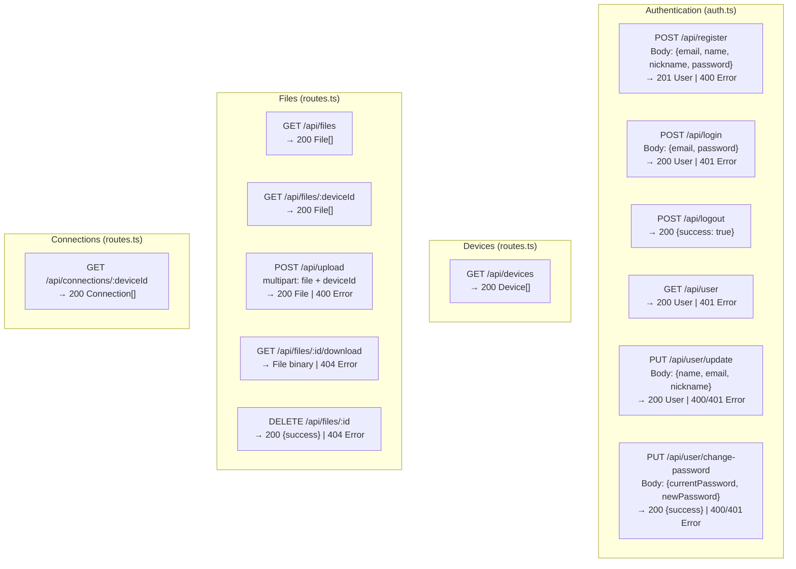
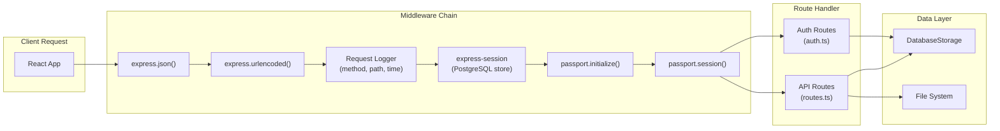
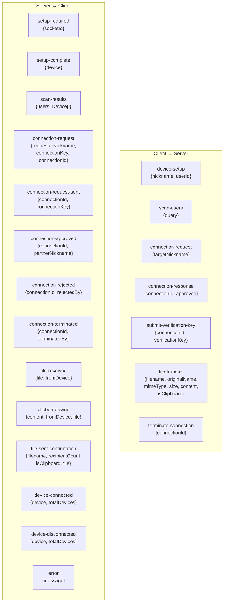
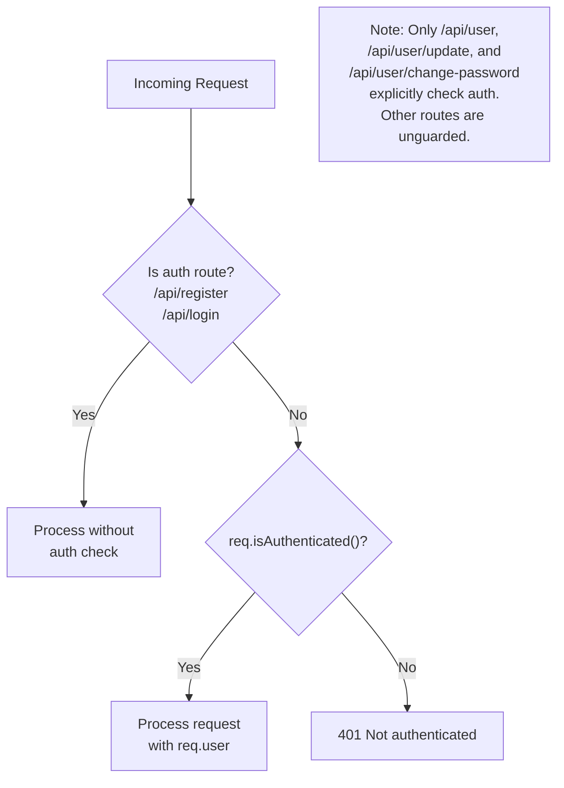

# SnapSend - API Routes Reference

## REST API Endpoints

```mermaid
graph TD
    subgraph "Authentication (auth.ts)"
        POST_Register["POST /api/register<br/>Body: {email, name, nickname, password}<br/>→ 201 User | 400 Error"]
        POST_Login["POST /api/login<br/>Body: {email, password}<br/>→ 200 User | 401 Error"]
        POST_Logout["POST /api/logout<br/>→ 200 {success: true}"]
        GET_User["GET /api/user<br/>→ 200 User | 401 Error"]
        PUT_Update["PUT /api/user/update<br/>Body: {name, email, nickname}<br/>→ 200 User | 400/401 Error"]
        PUT_Password["PUT /api/user/change-password<br/>Body: {currentPassword, newPassword}<br/>→ 200 {success} | 400/401 Error"]
    end

    subgraph "Devices (routes.ts)"
        GET_Devices["GET /api/devices<br/>→ 200 Device[]"]
    end

    subgraph "Files (routes.ts)"
        GET_AllFiles["GET /api/files<br/>→ 200 File[]"]
        GET_DeviceFiles["GET /api/files/:deviceId<br/>→ 200 File[]"]
        POST_Upload["POST /api/upload<br/>multipart: file + deviceId<br/>→ 200 File | 400 Error"]
        GET_Download["GET /api/files/:id/download<br/>→ File binary | 404 Error"]
        DELETE_File["DELETE /api/files/:id<br/>→ 200 {success} | 404 Error"]
    end

    subgraph "Connections (routes.ts)"
        GET_Connections["GET /api/connections/:deviceId<br/>→ 200 Connection[]"]
    end
```

## Request/Response Flow

```mermaid
flowchart LR
    subgraph "Client Request"
        Browser["React App"]
    end

    subgraph "Middleware Chain"
        JSON["express.json()"]
        URL["express.urlencoded()"]
        Logger["Request Logger<br/>(method, path, time)"]
        Session["express-session<br/>(PostgreSQL store)"]
        PassInit["passport.initialize()"]
        PassSession["passport.session()"]
    end

    subgraph "Route Handler"
        AuthRoutes["Auth Routes<br/>(auth.ts)"]
        APIRoutes["API Routes<br/>(routes.ts)"]
    end

    subgraph "Data Layer"
        Storage["DatabaseStorage"]
        FileSystem["File System"]
    end

    Browser --> JSON --> URL --> Logger --> Session --> PassInit --> PassSession
    PassSession --> AuthRoutes
    PassSession --> APIRoutes
    AuthRoutes --> Storage
    APIRoutes --> Storage
    APIRoutes --> FileSystem
```

## WebSocket Message Protocol

```mermaid
graph TD
    subgraph "Client → Server"
        C2S1["device-setup<br/>{nickname, userId}"]
        C2S2["scan-users<br/>{query}"]
        C2S3["connection-request<br/>{targetNickname}"]
        C2S4["connection-response<br/>{connectionId, approved}"]
        C2S5["submit-verification-key<br/>{connectionId, verificationKey}"]
        C2S6["file-transfer<br/>{filename, originalName,<br/>mimeType, size, content,<br/>isClipboard}"]
        C2S7["terminate-connection<br/>{connectionId}"]
    end

    subgraph "Server → Client"
        S2C1["setup-required<br/>{socketId}"]
        S2C2["setup-complete<br/>{device}"]
        S2C3["scan-results<br/>{users: Device[]}"]
        S2C4["connection-request<br/>{requesterNickname,<br/>connectionKey, connectionId}"]
        S2C5["connection-request-sent<br/>{connectionId, connectionKey}"]
        S2C6["connection-approved<br/>{connectionId, partnerNickname}"]
        S2C7["connection-rejected<br/>{connectionId, rejectedBy}"]
        S2C8["connection-terminated<br/>{connectionId, terminatedBy}"]
        S2C9["file-received<br/>{file, fromDevice}"]
        S2C10["clipboard-sync<br/>{content, fromDevice, file}"]
        S2C11["file-sent-confirmation<br/>{filename, recipientCount,<br/>isClipboard, file}"]
        S2C12["device-connected<br/>{device, totalDevices}"]
        S2C13["device-disconnected<br/>{device, totalDevices}"]
        S2C14["error<br/>{message}"]
    end
```

## Authentication Guard Pattern

```mermaid
flowchart TD
    Request["Incoming Request"] --> IsAuthRoute{"Is auth route?<br/>/api/register<br/>/api/login"}

    IsAuthRoute -->|"Yes"| NoGuard["Process without<br/>auth check"]
    IsAuthRoute -->|"No"| CheckAuth{"req.isAuthenticated()?"}

    CheckAuth -->|"Yes"| Process["Process request<br/>with req.user"]
    CheckAuth -->|"No"| Reject["401 Not authenticated"]

    Note1["Note: Only /api/user,<br/>/api/user/update, and<br/>/api/user/change-password<br/>explicitly check auth.<br/>Other routes are unguarded."]
```
