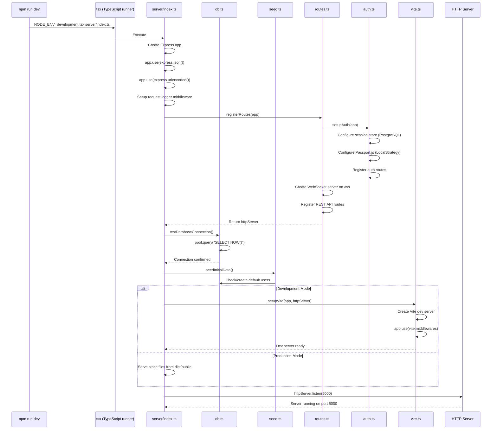
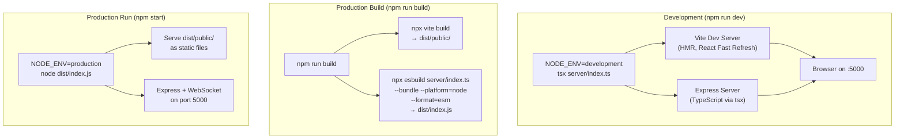
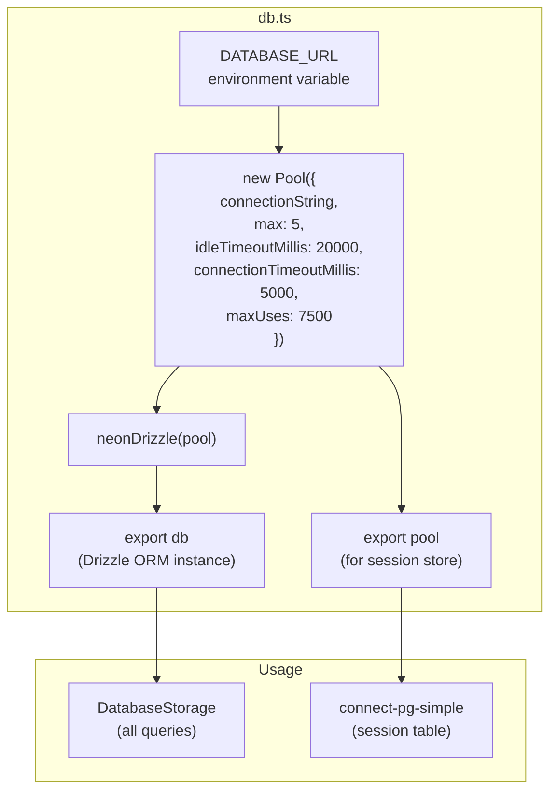
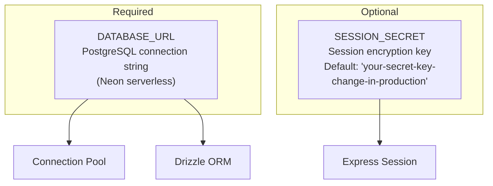
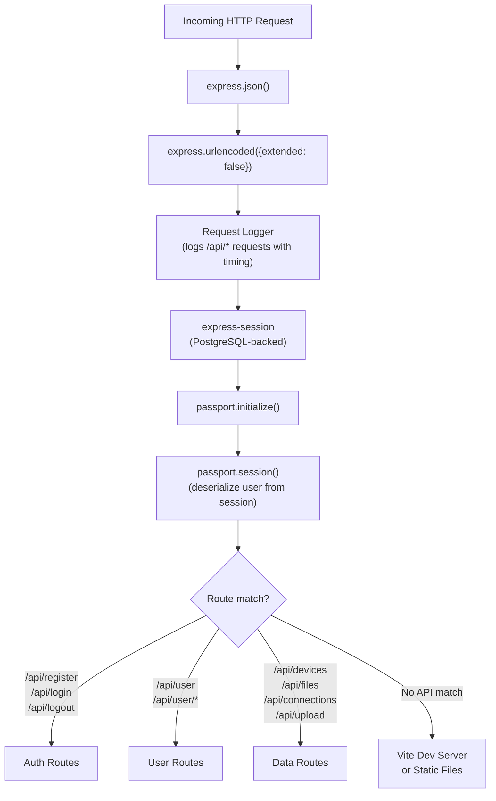

# SnapSend - Server Startup & Build Pipeline

## Server Startup Sequence

```mermaid
sequenceDiagram
    participant CLI as npm run dev
    participant TSX as tsx (TypeScript runner)
    participant Index as server/index.ts
    participant DB as db.ts
    participant Seed as seed.ts
    participant Routes as routes.ts
    participant Auth as auth.ts
    participant Vite as vite.ts
    participant HTTP as HTTP Server

    CLI->>TSX: NODE_ENV=development tsx server/index.ts
    TSX->>Index: Execute

    Index->>Index: Create Express app
    Index->>Index: app.use(express.json())
    Index->>Index: app.use(express.urlencoded())
    Index->>Index: Setup request logger middleware

    Index->>Routes: registerRoutes(app)
    Routes->>Auth: setupAuth(app)
    Auth->>Auth: Configure session store (PostgreSQL)
    Auth->>Auth: Configure Passport.js (LocalStrategy)
    Auth->>Auth: Register auth routes
    Routes->>Routes: Create WebSocket server on /ws
    Routes->>Routes: Register REST API routes
    Routes-->>Index: Return httpServer

    Index->>DB: testDatabaseConnection()
    DB->>DB: pool.query("SELECT NOW()")
    DB-->>Index: Connection confirmed

    Index->>Seed: seedInitialData()
    Seed->>DB: Check/create default users

    alt Development Mode
        Index->>Vite: setupVite(app, httpServer)
        Vite->>Vite: Create Vite dev server
        Vite->>Vite: app.use(vite.middlewares)
        Vite-->>Index: Dev server ready
    else Production Mode
        Index->>Index: Serve static files from dist/public
    end

    Index->>HTTP: httpServer.listen(5000)
    HTTP-->>Index: Server running on port 5000
```

## Build Pipeline

```mermaid
flowchart TD
    subgraph "Development (npm run dev)"
        DevCmd["NODE_ENV=development<br/>tsx server/index.ts"]
        DevCmd --> ViteDev["Vite Dev Server<br/>(HMR, React Fast Refresh)"]
        DevCmd --> ExpressDev["Express Server<br/>(TypeScript via tsx)"]
        ViteDev --> Browser["Browser on :5000"]
        ExpressDev --> Browser
    end

    subgraph "Production Build (npm run build)"
        BuildCmd["npm run build"]
        BuildCmd --> ViteBuild["npx vite build<br/>→ dist/public/"]
        BuildCmd --> ESBuild["npx esbuild server/index.ts<br/>--bundle --platform=node<br/>--format=esm<br/>→ dist/index.js"]
    end

    subgraph "Production Run (npm start)"
        StartCmd["NODE_ENV=production<br/>node dist/index.js"]
        StartCmd --> StaticServe["Serve dist/public/<br/>as static files"]
        StartCmd --> ExpressProd["Express + WebSocket<br/>on port 5000"]
    end
```

## Database Connection Setup

```mermaid
flowchart TD
    subgraph "db.ts"
        EnvVar["DATABASE_URL<br/>environment variable"]
        EnvVar --> NeonPool["new Pool({<br/>connectionString,<br/>max: 5,<br/>idleTimeoutMillis: 20000,<br/>connectionTimeoutMillis: 5000,<br/>maxUses: 7500<br/>})"]
        NeonPool --> NeonDrizzle["neonDrizzle(pool)"]
        NeonDrizzle --> DrizzleDB["export db<br/>(Drizzle ORM instance)"]
        NeonPool --> ExportPool["export pool<br/>(for session store)"]
    end

    subgraph "Usage"
        DrizzleDB --> Storage["DatabaseStorage<br/>(all queries)"]
        ExportPool --> SessionStore["connect-pg-simple<br/>(session table)"]
    end
```

## Environment Variables

```mermaid
graph TD
    subgraph "Required"
        DB_URL["DATABASE_URL<br/>PostgreSQL connection string<br/>(Neon serverless)"]
    end

    subgraph "Optional"
        SESSION_SECRET["SESSION_SECRET<br/>Session encryption key<br/>Default: 'your-secret-key-change-in-production'"]
    end

    DB_URL --> Pool["Connection Pool"]
    DB_URL --> Drizzle["Drizzle ORM"]
    SESSION_SECRET --> Session["Express Session"]
```

## Middleware Stack (Order Matters)

```mermaid
flowchart TD
    Request["Incoming HTTP Request"]
    Request --> M1["express.json()"]
    M1 --> M2["express.urlencoded({extended: false})"]
    M2 --> M3["Request Logger<br/>(logs /api/* requests with timing)"]
    M3 --> M4["express-session<br/>(PostgreSQL-backed)"]
    M4 --> M5["passport.initialize()"]
    M5 --> M6["passport.session()<br/>(deserialize user from session)"]
    M6 --> M7{"Route match?"}

    M7 -->|"/api/register<br/>/api/login<br/>/api/logout"| AuthRoutes["Auth Routes"]
    M7 -->|"/api/user<br/>/api/user/*"| UserRoutes["User Routes"]
    M7 -->|"/api/devices<br/>/api/files<br/>/api/connections<br/>/api/upload"| DataRoutes["Data Routes"]
    M7 -->|"No API match"| ViteOrStatic["Vite Dev Server<br/>or Static Files"]
```
