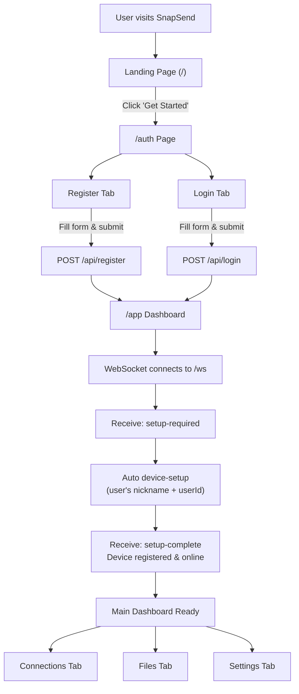
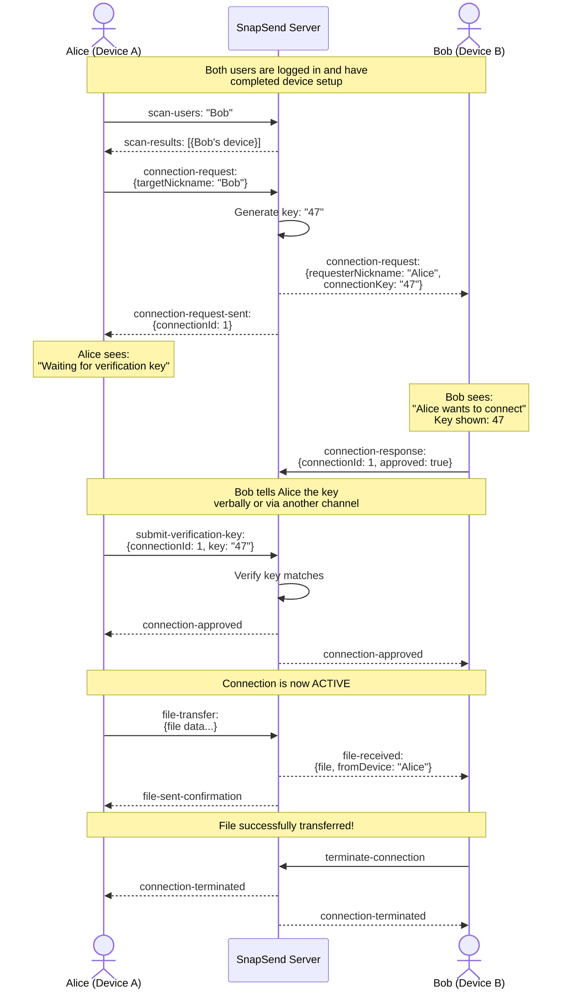
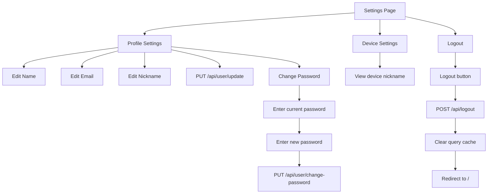
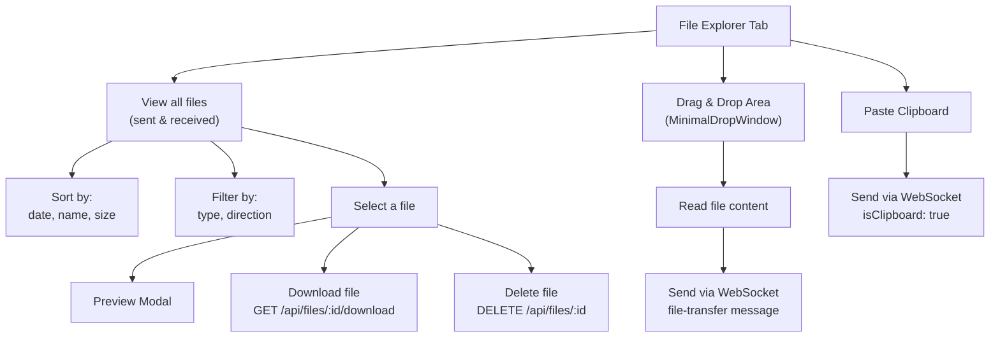
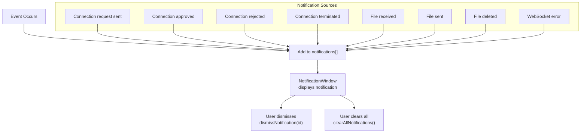

# SnapSend - End-to-End User Journey

## Complete User Flow: Registration to File Transfer

## Two-Device Connection Scenario

## Settings Page Flow

## File Explorer User Flow

## Notification Lifecycle

