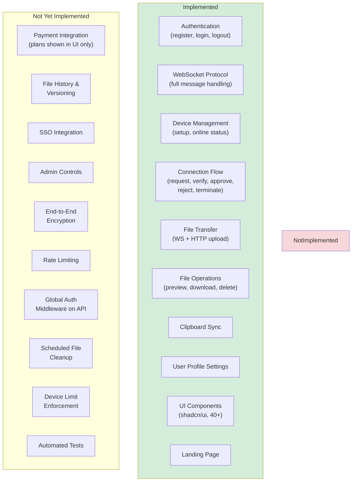
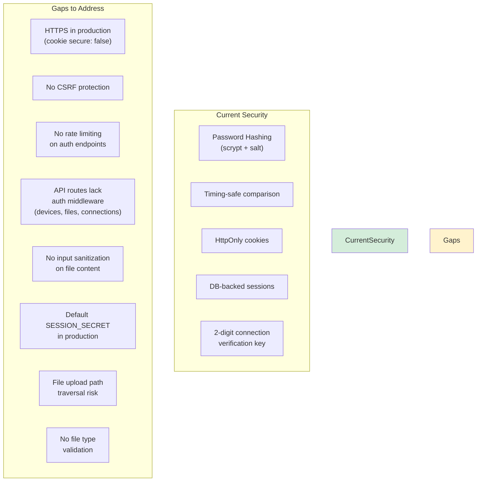
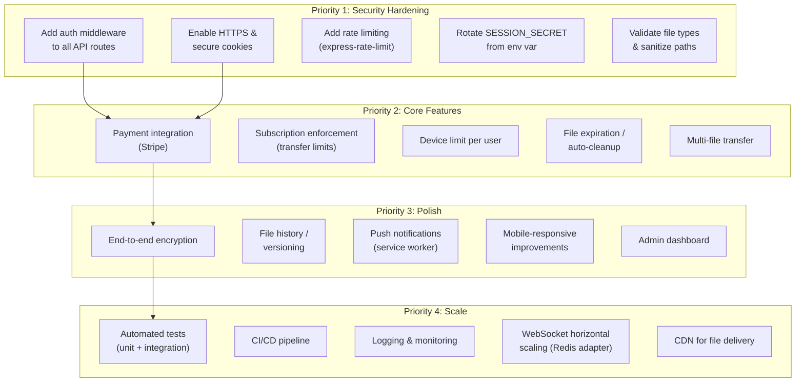
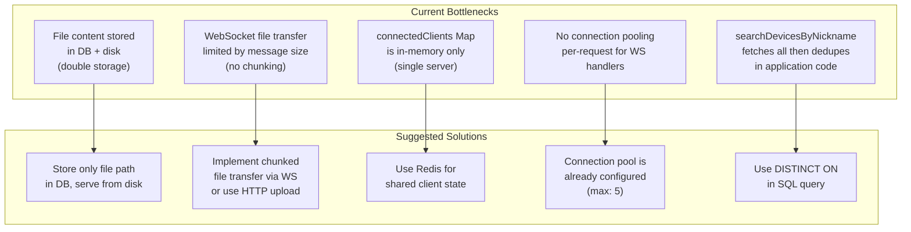
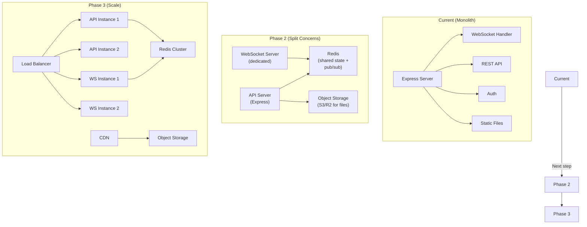

# SnapSend - Development Roadmap & Architecture Gaps

## Current State Overview

## Security Considerations

## Suggested Feature Priorities

## Data Flow Bottleneck Analysis

## Recommended Architecture Evolution

