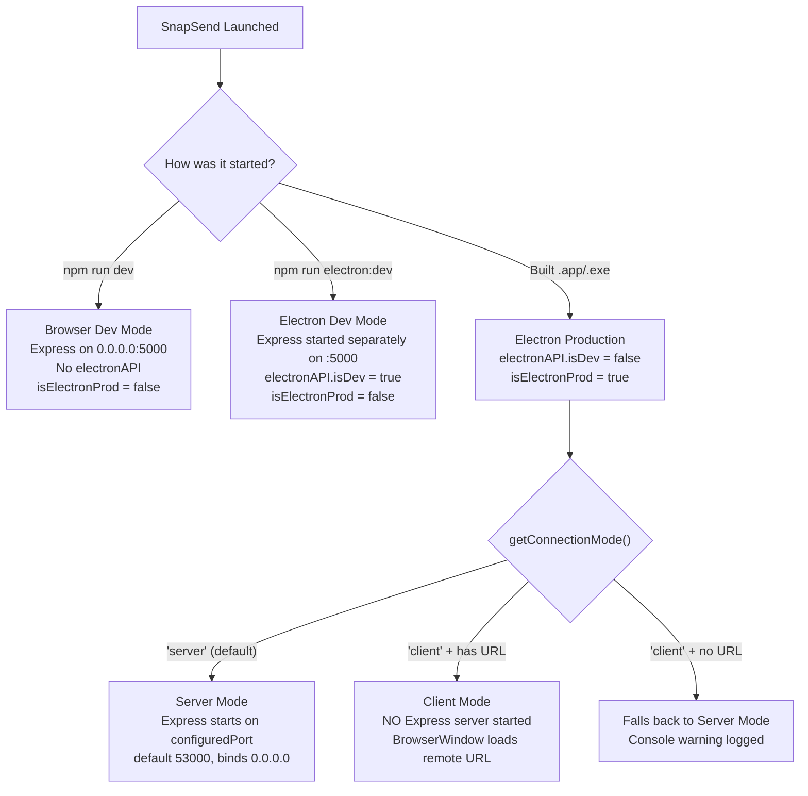
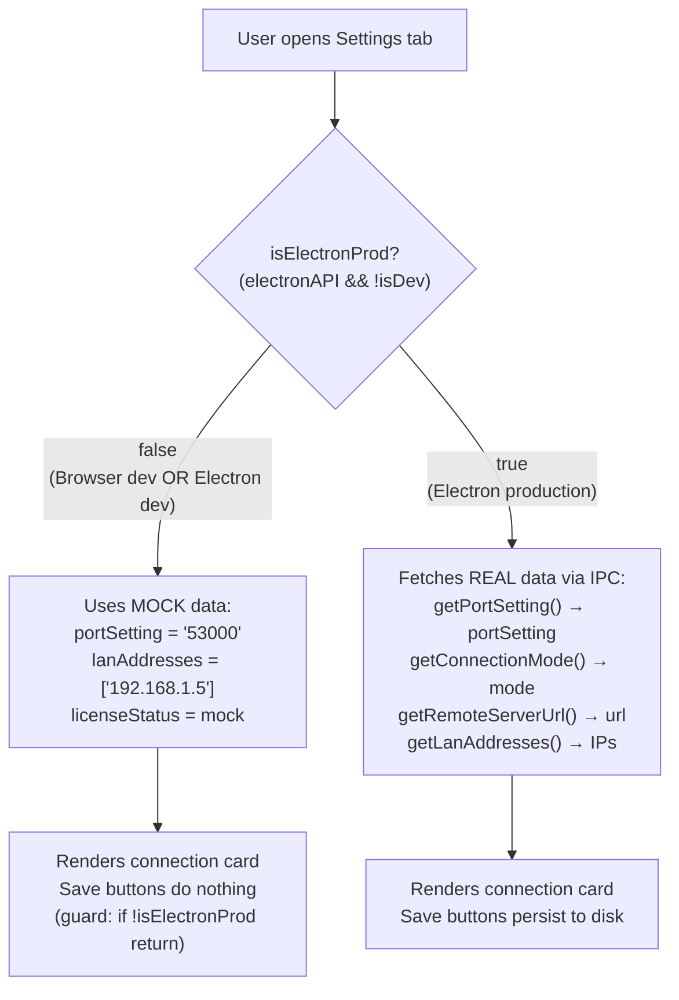
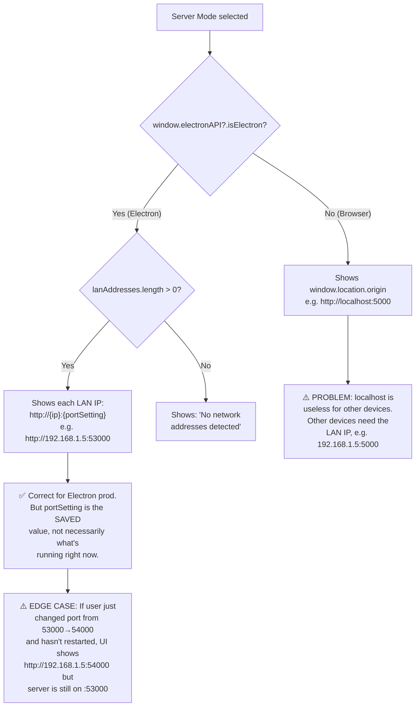
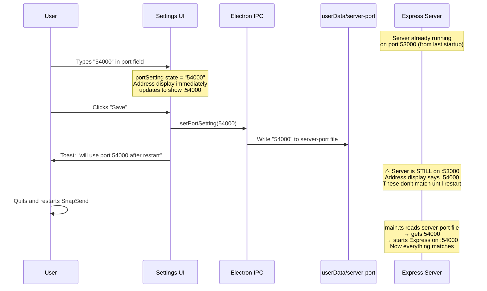
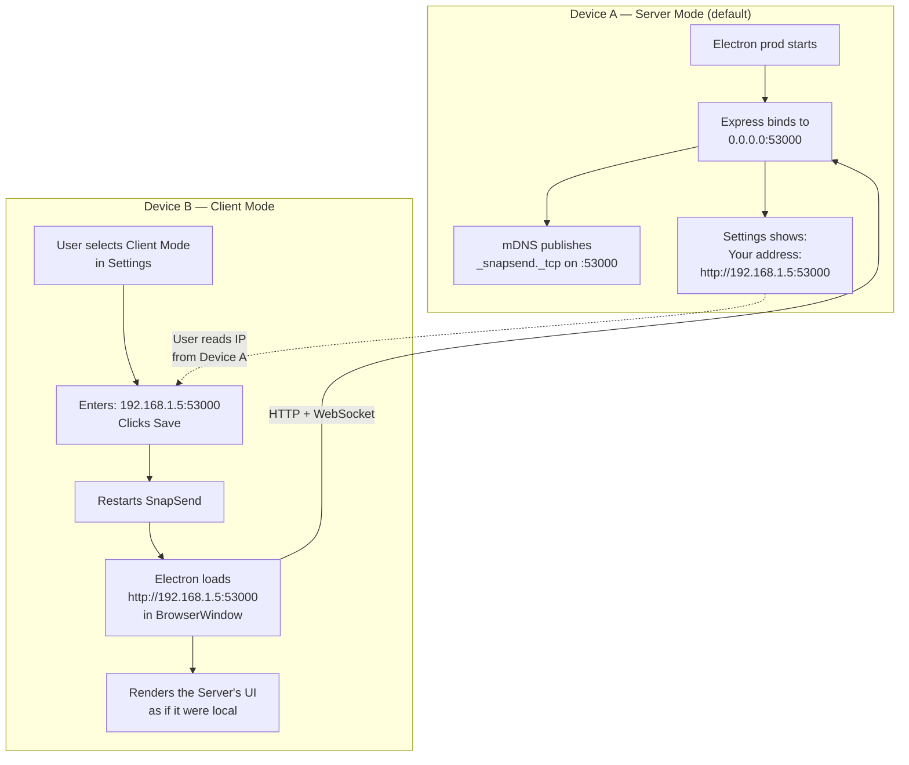
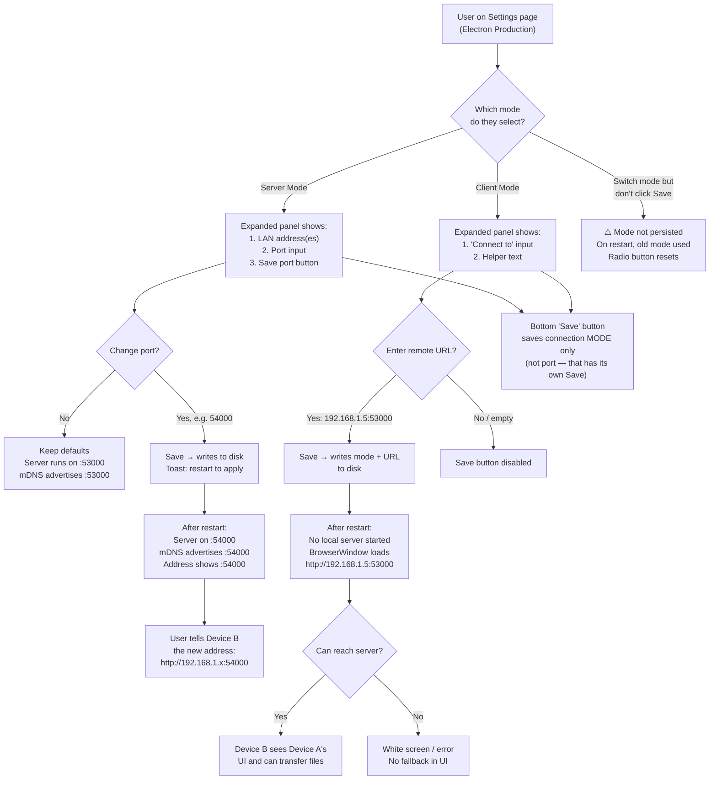
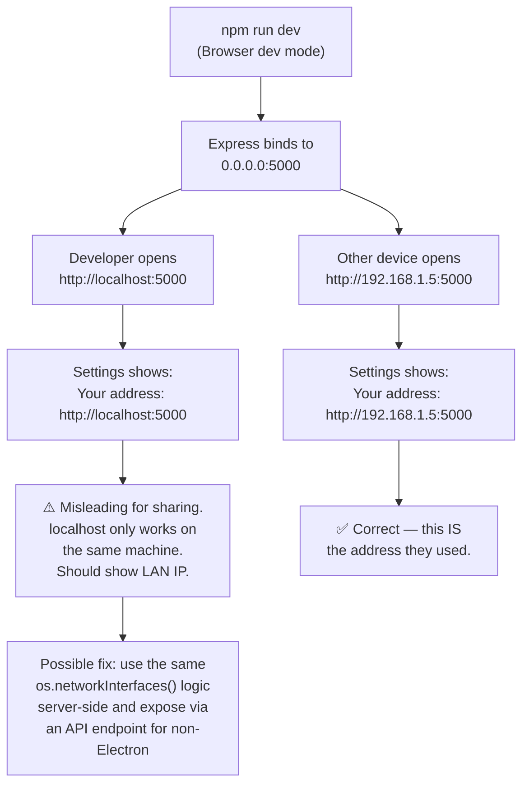
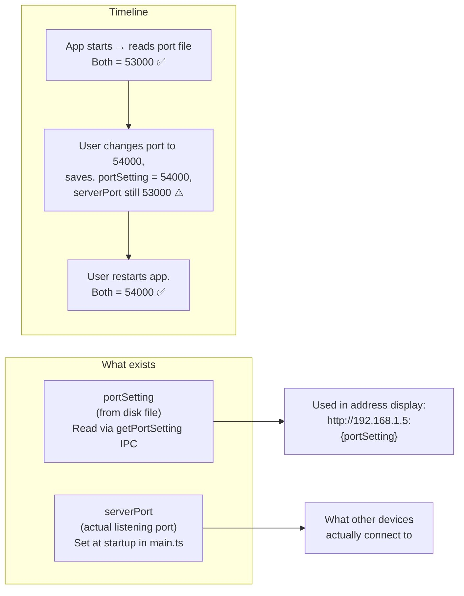

# Connection Settings — Decision Logic & Data Flow

This document maps every path through the Connection Mode settings UI, what each runtime environment actually does, and where the current logic is confusing or broken.

---

## 1. Runtime Environments

There are four distinct runtime contexts. The settings UI behaves differently in each.

---

## 2. What the Settings UI Shows in Each Environment

---

## 3. Server Mode — Address Display Logic

This is the main source of confusion. What address is shown depends on the runtime.

---

## 4. Port Setting — What Changes and When

---

## 5. The Two-Device Pairing Scenario

This is the primary use case for connection settings: Device A runs as Server, Device B connects as Client.

---

## 6. All Connection Mode Choices — Decision Tree

---

## 7. Browser Dev Mode — Separate Problem

---

## 8. Port Value Discrepancy — `portSetting` vs Actual Port

The settings UI has a subtle bug: the displayed address uses `portSetting` (the saved-to-disk value), which can differ from the port the server is actually listening on.

---

## 9. Summary of Issues Found

| # | Issue | Where | Severity |
|---|-------|-------|----------|
| 1 | Browser dev mode shows `localhost:5000` as shareable address — other devices can't use localhost | SettingsPage.tsx line 162 | Medium |
| 2 | After changing port but before restart, address display shows new port but server is still on old port | SettingsPage.tsx line 154 | Low |
| 3 | Two separate Save buttons (port vs mode) with unclear scope — user may think one saves everything | SettingsPage.tsx lines 180, 258 | Medium |
| 4 | Client mode with no URL entered: Save is disabled, but if user somehow saved empty URL previously, app falls back to server mode silently | electron/main.ts line 210 | Low |
| 5 | No visual feedback that current port differs from saved port (no "current: X, will change to: Y" display) | SettingsPage.tsx | Low |
